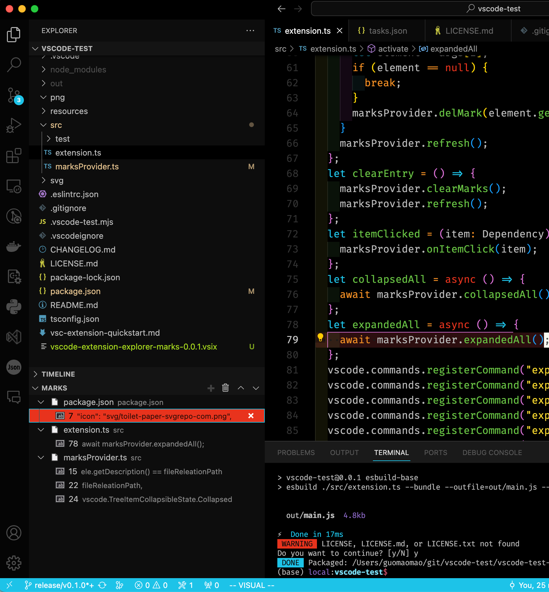

# vscode-test README

** this is a project for learn to develop vscode extension **

** NOT RELEASE IN MARKETPLACE **

This is a vscode extension for record marks of file and line
Quick jump to mark

default hot-key is

windows: ctrl+4

mac: command+4

